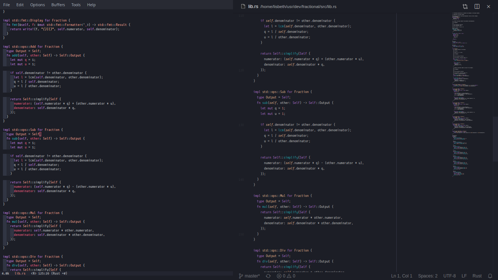

# Horizon


A [Horizon](https://horizontheme.netlify.com) theme by [jolaleye](https://github.com/jolaleye), ported from Visual Studio Code to Emacs by aodhneine.

# Installation
This package is (soon) available on [MELPA](https://melpa.org/). To install it, just put this in your init file:

``` emacs-lisp
(require 'package)
(add-to-list 'package-archives
             '("melpa" . "http://melpa.milkbox.net/packages/") t)
```
and then use `M-x package-install RET horizon-theme RET`. Also use `M-x customize-themes` to change your current theme.

If you don't want to use MELPA, you can also install this theme manually. Just download the theme (for example through `git clone`):

``` shell
git clone https://github.com/aodhneine/horizon-theme.el
```
and then add the following lines to your init file:

``` emacs-lisp
(add-to-list 'load-path "path/to/horizon/theme/")
(load-theme 'horizon t)
```

## Contribution
You can contribute to this theme by cloning the repo, making your changes and then creating pull requests. Because of lack of time, I only added support for faces which I use, so many may be lacking. Thank you very much for your interest in this project. <3
