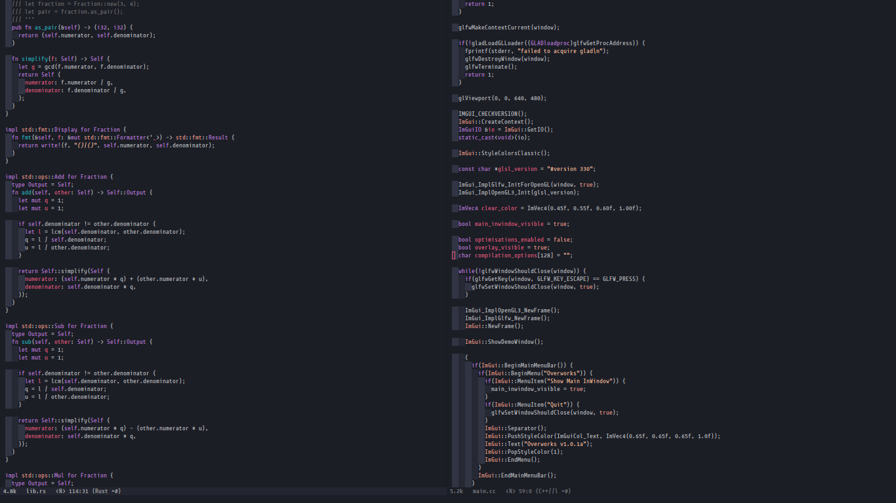

# Horizon


A [Horizon](https://horizontheme.netlify.com) theme by [jolaleye](https://github.com/jolaleye), ported from Visual Studio Code to Emacs by aodhneine.

# Installation
This package is **not** yet available on MELPA, for the time being you can install this theme manually. Just clone this repository:
``` shell
git clone https://github.com/aodhneine/horizon-theme.el.git
```
and then add the following lines to your init file:
``` emacs-lisp
(add-to-list 'custom-theme-load-path "path/to/horizon/theme/repository/")
(load-theme 'horizon t)
```

## Contribution
You can contribute to this theme by cloning the repo, making your changes and then creating pull requests. Because of lack of time, I only added support for faces which I use, so many may be lacking. Thank you very much for your interest in this project. <3
